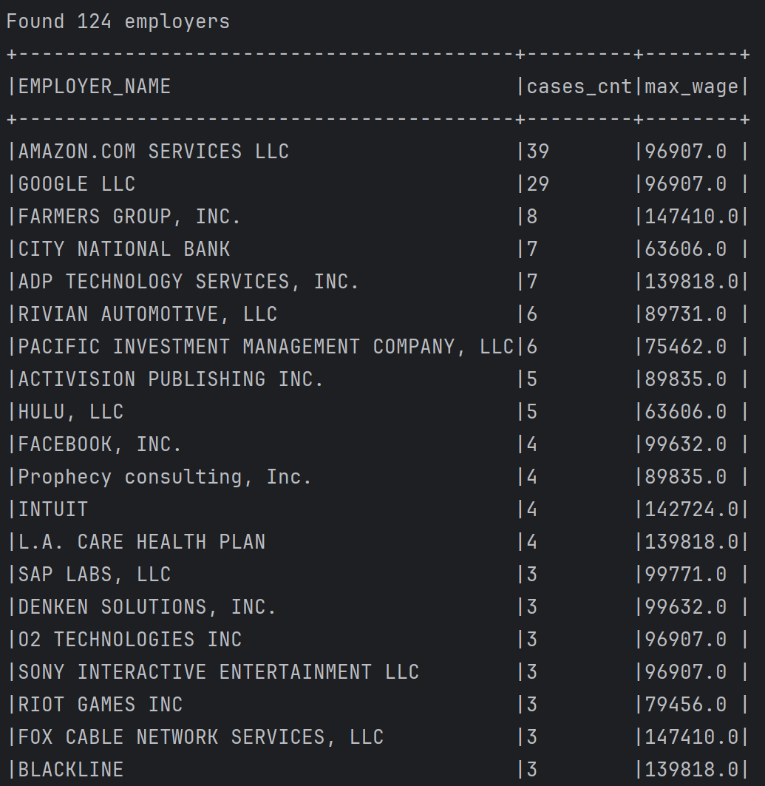

# performance-report-parser
An app to parse *PERM_Disclosure_Data_FY2023_Q4.xlsx* report from: https://www.dol.gov/agencies/eta/foreign-labor/performance  

## Workflow
1. During the first run the app transforms xlsx to csv if the csv doesn't exist yet (might take ~ 3 min). This step is skipped for the next runs of the app. 
2. Then it parses the csv report
3. Finally, it shows chart:
   
   and prints employers:
   
